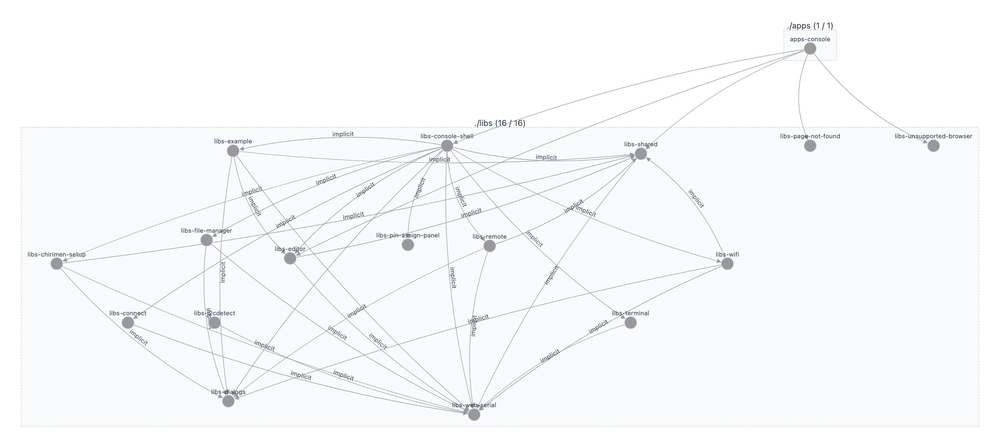

# アーキテクチャ概要

本リポジトリは Nx モノレポです。メインアプリと機能別ライブラリで構成されています。

## 構成

- **apps/console** — CHIRIMEN Lite Console のメイン Angular アプリ。ルーティング・レイアウト・各機能画面を束ねる。
- **libs/** — ドメインまたは横断 concern ごとのライブラリ。アプリから `@libs-<domain>` で参照する。

## lib 内部構成

各ドメイン lib（例: `libs/wifi`）は単一の Nx プロジェクトとし、`src/lib/` 配下を役割別フォルダで整理する。

| フォルダ | 内容の例 |
| -------- | -------- |
| `component/` | ページ・UI コンポーネント |
| `service/` | データアクセス・ドメインサービス |
| `functions/` | 純関数・パーサ |
| `models/` | 型・インターフェース |
| `constants/` | 定数 |
| `dialogs/` | ダイアログコンポーネント（該当 lib のみ） |
| `guards/` | ルートガード（shared lib 等） |

## 主な lib の役割

| カテゴリ | lib | 役割 |
|----------|-----|------|
| 接続・シェル | connect, console-shell | デバイス接続 UI・シェルレイアウト |
| 端末・編集 | terminal, editor | ターミナル表示・コードエディタ |
| 機能 | example, wifi, chirimen-setup, file-manager, pin-assign-panel, remote, i2cdetect | サンプル一覧・Wi‑Fi・セットアップ・ファイル操作・ピン割り当て・リモート・I2C 検出 |
| 共通 | dialogs, shared | ダイアログ・共有 UI / ガード / 型 / ユーティリティ |
| 基盤 | web-serial | Web Serial API のラップ・状態管理 |
| その他 | page-not-found, unsupported-browser | 404・非対応ブラウザ表示 |

現行のプロジェクト一覧は `pnpm nx show projects` で確認できる。

## Web Serial と外部ライブラリの境界

汎用パッケージ [@gurezo/web-serial-rxjs](https://www.npmjs.com/package/@gurezo/web-serial-rxjs) と本リポジトリの役割分担、`terminalText$` / `lines$` を中心とした受信ストリームの使い分け、新機能の置き場所の目安は [docs/serial-architecture.md](docs/serial-architecture.md) を参照する。実装レイヤの詳細は [libs/web-serial/README.md](libs/web-serial/README.md) にある。

## 依存関係

`npx nx graph` で生成したプロジェクト依存関係グラフ。アプリ・shell・feature・共有 lib の関係を示す。

層構造の目安:

- **アプリ** (`apps/console`) → `console-shell`、画面系（`page-not-found` / `unsupported-browser`）、必要に応じて `shared`
- **シェル** (`console-shell`) → 各 feature lib（多くは lazy route 向けの `implicitDependencies`）
- **feature**（`example` / `wifi` / `editor` / `file-manager` / `terminal` / `remote` / `pin-assign-panel` など）→ `shared` や `web-serial` などの共有・基盤層
- **セットアップ系**: `chirimen-setup` → `connect` など、接続フローに沿った依存チェーン

その他:

- アプリ (`apps/console`) は必要な lib を `tsconfig.base.json` の path エイリアス（`@libs-<domain>`）でインポートする。
- lib 間の依存は Nx の `project.json` の `implicitDependencies` とビルド順で管理される。
- 詳細な path 一覧は `tsconfig.base.json` の `compilerOptions.paths` を参照。

### グラフの再生成

構成が大きく変わったときは、次の手順で `graph.png` を差し替える。

1. `npx nx graph` でプロジェクトグラフを開く
2. 画像としてエクスポートする
3. リポジトリルートの `graph.png` を上書きする
4. 本ファイルの説明がグラフとずれていれば合わせて更新する

## ビルド・テスト

- 全プロジェクトのビルド: `pnpm nx run-many -t build`
- 全プロジェクトのテスト: `pnpm nx run-many -t test`
- CI では `nx affected -t lint,build,test` により変更影響範囲のみ実行。
